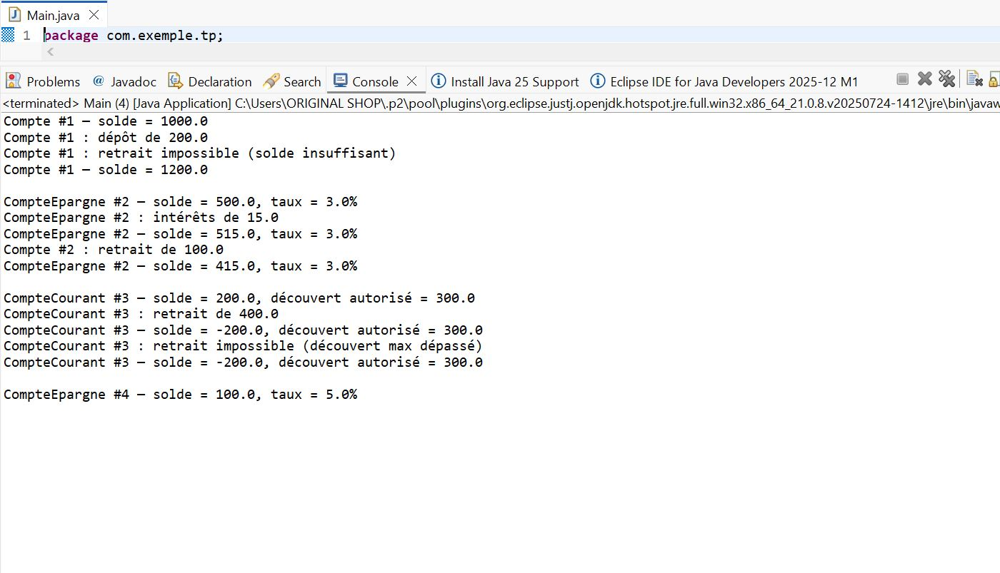

# 🧠 TP5 - Programmation JAVA

Ce projet contient les exercices du TP5 en JAVA.

## 📸 Captures d’écran

Voici les résultats d’exécution :
 Compte-Bancaire : 



Vehicules :


ZOO :


Bibliotheque :


---

## ⚙ Compilation
```bash
g++ main.cpp -o main
./main
