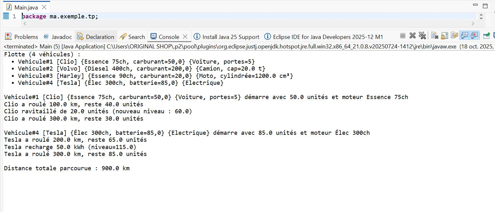
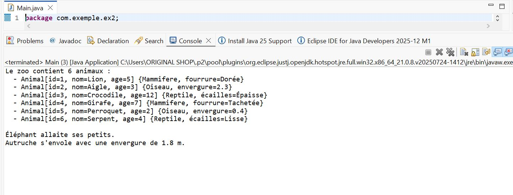
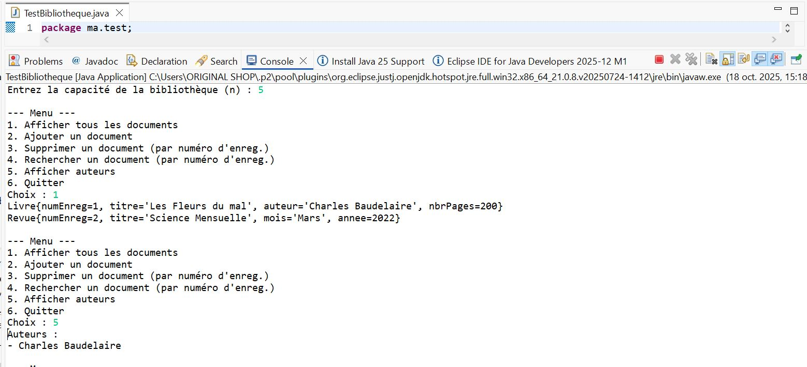

# 🧠 TP5 - Programmation JAVA

Ce projet contient les exercices du TP5 en JAVA.

## 📸 Captures d’écran

Voici les résultats d’exécution :


 Compte-Bancaire : 


Vehicules :



ZOO :



Bibliotheque :



---

## ⚙ Compilation
```bash
g++ main.cpp -o main
./main
